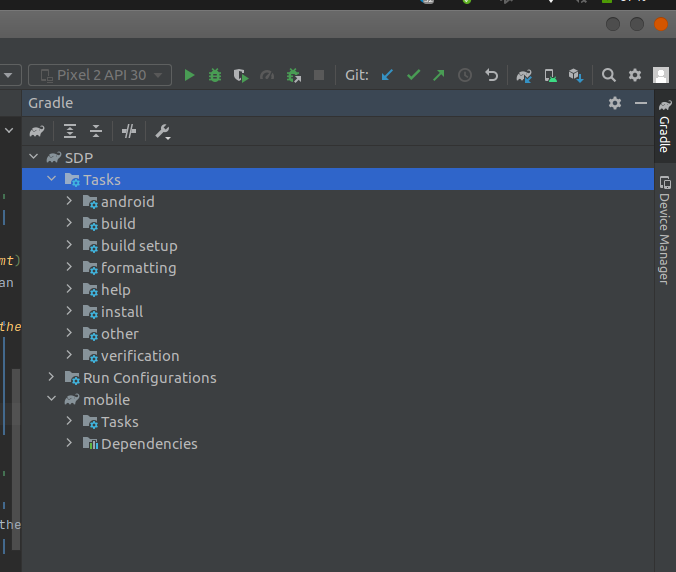
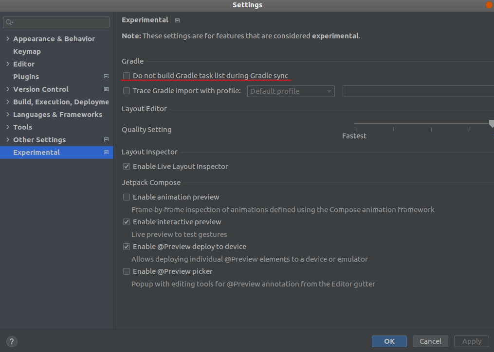
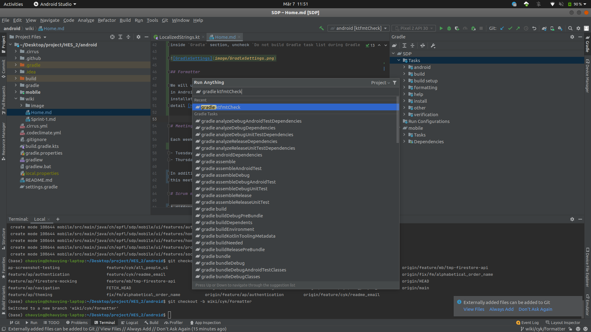

# Pawnies' Wiki !

You can find here information about the organization and the workflow of this repo!

# Workflow

## Naming convention
- All branches must follow this structure : `type/initial/branch_name`
   - The `type` can be : `feature`, `fix`
   - Each contributor has an initial, you can find this information at the end of this section
   - The `branch_name` must be meaningful and be separated by an underscore

| Name                 | Initial |
|----------------------|---------|
| Lars Barmettler      | LB |
| Matthieu Burguburu   | MB |
| Chau Ying Kot        | CYK |
| Fouad Mahmoud        | FM |
| Alexandre Piveteau   | AP |
| Mohamed Badr Taddist | BT |

## Pull request

- Each PR must be linked to the corresponding issue.
- You can use the Draft PR, if you want an early review
- For the reviewer, you can prefix your comments with a keyword that indicating the kind of comment
  it is, here is a short list of keywords :
    - Important
    - Nitpick
    - Question
    - Bug
    - Proposition

## Gradle

Make sure to have gradle tasks in the gradle tab inside Android studio.

If your tab isn't like the one on the screen shot, go to `File->Settings...->Experimental`,
inside `Gradle` section, uncheck `Do not build Gradle task list during Gradle sync`. Don't forget to rebuild gradle project!

## Formatter

We will use Facebook Kotlin formatter [ktfmt](https://github.com/facebookincubator/ktfmt). To use it
in Android studio, you need to download their plugin from the IDE's marketplace. You can find the
installation
detail [here](https://github.com/facebookincubator/ktfmt#intellij-android-studio-and-other-jetbrains-ides)

You can run the formatting check on you local machine. Click on the elephant button on the `Gradle`
tab and tap `ktfmtCheck` in the search bar.

# Meeting

Each week, we have 2 stand-up meetings :

- Tuesday at 12:45
- Thursday at 12:45

In addition to the stand-up, we have a sprint review with our TAs Friday at 11:15. At the end of
this meeting, the Scrum Team will plan the content of the next sprint backlog.

# Scrum master rotation order

A different Scrum master is chosen for each sprint, in the following cyclic order starting from
Sprint 1:

1. Alexandre Piveteau
2. Mohamed Badr Taddist
3. Chau Ying Kot
4. Lars Barmettler
5. Matthieu Burguburu
6. Fouad Mahmoud
