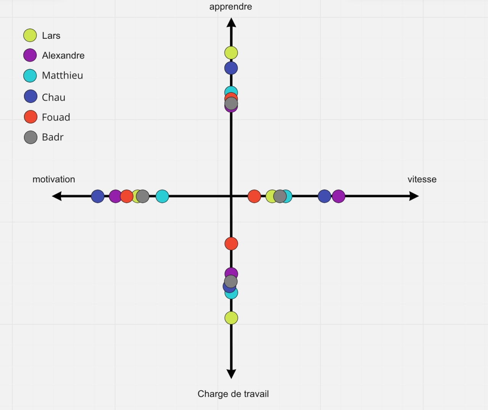

# Sprint 4

## Summary

This Sprint was the first sprint with a two-week duration. This introduced some organizational benefits and drawbacks. While we had less stress to finish something in one week, it was more difficult to estimate the workload over the whole sprint correctly. The two-week sprint interval also removes some overhead and allocates some more time which we can use to work on the project or organize a Retrospective. The latter we did last Friday to improve the work together and check the mood of the group. I think we well progressed this sprint and we are looking forward to implementing some new interesting features.

## Lars Barmettler (Scrum Master)

The last two weeks I was able to work quite productive. In the first week I could correct a refactoring some ill-favoured code which I wrongly implemented in the previous sprint. This was not that hard to do such that I quickly progressed to my second task. The second task, however, was quite demanding and so I often took consultation by Alexandre. He showed me how to solve this problem in a Kotlin way. I really like that we can ask without hesitation questions each other and getting quickly a respond. We should continue to stick to this mindset for the rest of the project.

## Matthieu Burguburu

My main task for this sprint was to finish the design of the "Prepare game" screen on Figma, and implement both its UI and logic. My time estimates for these tasks were pretty good, but I took some extra unplanned time to implement a feature closely-related to this but which was slightly misplanned. However, this was nothing major and did not hinder me in my main task.

Additionally, I had to finish increasing the coverage on a feature from last sprint. This should not have taken much time, but it lead to some refactoring and was a bit longer than expected.

Overall, I think this 2 week sprint went quite well and did not make it harder to deliver my features than previous shorter sprints.

## Chau Ying Kot

For this sprint, I have a even better understanding on SceneView(the library used to display AR) and their project is structured. And now, I see all the possibilities we have at our disposal.

The app can display a board, but this view miss some UI to help the user to understand the game state. This is a problem that we did not anticipate.

The AR part isn’t well integrated into the project, but it was needed to fully understand how to use the library. Now we can refactor to remove some redundancy. We already discuss this in the team and we have some idea how to refactor the project to integrate that.

For this sprint, I was also in charge to define a naming convention for the tests and fix the CI that didn’t see the report for the unit test

## Fouad Mahmoud

This sprint was a little bit difficult for me. I was sick on Sunday 27th for a week and this made me unable to progress well during the first week of this sprint. I did manage to catch up by the end of the week but had to balance my two tasks in a limited amount of time because of this unfortunate situation. 

I learned during this sprint to check if there are already existing methods and classes that help my assigned functionality before coding, as I did often fall into the trap of coding something that has already been done by someone else and having to undo my work. My Kotlin and Jetpack Compose knowledge was also enhanced during this sprint.

My tasks for this sprint were more convenient and I am thankful that my sickness happened during a two-week sprint to give me more time to catch up.

Next time, I will try to start my tasks even earlier to give myself more time to ask questions when faced with potential bugs and unpredictable events.

## Alexandre Piveteau 

My original tasks for this sprint consisted in revamping the 2d chess board, by adding support for clicking to move pieces (rather than only dragging), as well as showing some additional information (such as the adversaries names, or if the game was stale or over). While these tasks took the amount of time I was expecting them to, I finished them very early in the second week and it was decided that I’d get some supplementary tasks.

I therefore implemented prefix matching for user search, revamped the following screen so that it actually matches the Figma mockups, and fixed a few low-hanging bugs. I also gave a hand to some of my teammates for some of their tasks (typically, integrating voice recognition with coroutines or making some custom layouts for the adversary selection dialog).

Overall, my time estimates were accurate but I was able to squeeze in more hours in the project and therefore had to increase my workload.
## Mohamed Badr Taddist 

This sprint went well in general. I attended all meeting in person as I was feeling much better. My PR took sometime to be ready due some technicalities. My time estimates were a bit of this time as the feature I implemented this sprint was much more hard to test, and consequenty, I had to make numerous refactorings.